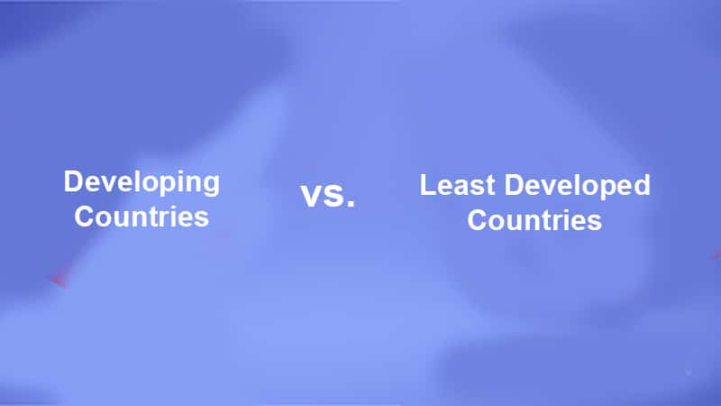

# 2021Fall_finals
# Analysis Of Factors Affecting Food Prices

## Team members: 

Darshan Pangare (pangare2, Github: DarshanPangare)
Nemil Shah (nemil2, Github: Nemilshah1999)

## Overview: 

Authorities are becoming increasingly concerned about price swings as global warming threatens to undermine the food supply. There has been a variance in the prices of some commodities around the world in recent decades. 

Some of these effects on food are less severe, but many come with the potential for harmful consequences: toxins produced by crops in response, record-breaking high temperatures, delays in the transportation of crops and foods, imbalances in supply and demand, and skyrocketing prices for produce.

There are various reasons why food prices are rising in various part of the world, in the short-term, many factors affect food prices, making them volatile. These factors include supply and demand, weather, disease outbreaks, war, and natural disasters.

Variations in food prices are associated with several factors:

1.     Country’s development status.

2.     Unpredictable temperature and weather variations

3.     Natural disasters or calamities destroy the harvested produce, resulting in lower supply and higher demand.

## Datasets:

All the data files used in the program can be found on the below links. One would need to download these files to run the code on their local machine.

1.     Global food prices dataset: https://www.kaggle.com/jboysen/global-food-prices

2.     Country Status Dataset: https://github.com/DarshanPangare/2021Fall_finals/blob/main/Dataset/Country_status_price.xlsx

3.     Food prices dataset for United State: https://www.fao.org/faostat/en/#data/PP

4.     Storm dataset for various years: https://www.ncei.noaa.gov/pub/data/swdi/stormevents/csvfiles/

## To analyze the scenario described above, we have proposed the following hypotheses:

## Hypothesis 1: The hike in the price of food for developing countries is low as compared to underdeveloped countries.

H1: The hike in the price of food for developing countries does not influence the price of food in underdeveloped countries.

Here, we compare the price of several commodities over the years for different pairs of developing and underdeveloped countries. We have converted the food prices from different regions to a common USD scale. This has helped us in analyzing and plotting the data. The food commodity that we chose were Bread and Wheat. 

# Result:

From the analysis, it is clearly evident that the food prices in Developing and Underdeveloped countries are not related.
Therefore we reject our hypothesis.

## Hypothesis 2: 

Null hypothesis: The occurrence of a natural disaster such as storm has effect over the rise in food prices.

Alternative hypothesis: The occurrence of a natural disaster such as storm would not have much effect over food prices.

# Result:

From the analysis, we observe that some of the plots such as Cauliflower and Brocolli, Peas dry have P-value (i.e. the second value) lower than 0.05 which might seem that it follows the idea proposed in the null hypothesis. But most of the plots such as wheat, apples etc do not follow the trend. Also as the P value is greater than 0.05 and the correlation is close to 0 so we can say that, we fail to prove that storm prices have significant effect on the food crops.

Therefore, we reject our null hypothesis.

